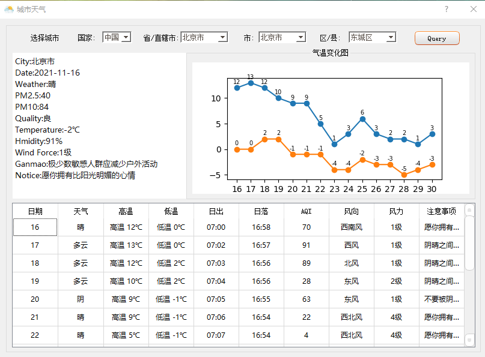

### 1 使用说明

#### 1.1 环境配置

- 基于`python3.7+pyqt5`编写
- 创建python虚拟环境venv
- 使用`pip install -r requirements.txt`安装依赖包

#### 1.2 API配置

- 获取天气数据API：`http://t.weather.itboy.net/api/weather/city/`，根据城市代码查询具体天气，城市代码在`CityCode.json`文件中。

- API若出现问题，可自行替换。


### 2 界面展示

- 对API返回的数据进行可视化展示
- 实现省市区三级联动，可自行选择查询天气的城市
- 绘制15日内天气走势图




### 3 程序打包

- 安装pyinstaller，`pip install pyinstaller`;
- 使用`pyinstaller`QT程序打包，无控制台界面弹出，命令行如下：

```shell
pyinstaller -F -i ./resource/cloud_128.ico -p ./venv/Lib/site-packages -p ./ui ./query_weather.py --noconsole
```

#### 

- 编译完成后，可执行文件`query_weather.exe`在`dist`文件夹中，其他windows设备可直接运行，`build`为过程文件夹


